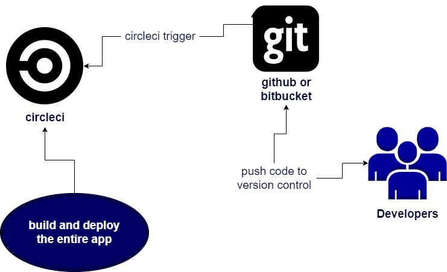

# Pipeline
----------

## Continuous Integration
### First 
* developer push code to github then circleci triggers that action and starts to execute the pipeline

### Second
after the first step the pipeline goes through three major phases**
 ##### Phase 1 installation 
  - the pipeline in that phase pipeline install all app dependencies in order to make the application run
##### Phase 2 build
 - in this phase we tell pipeline to build the application throw a giving script to compile any script needs to compile or even transpile scripts like typescript to javaScript or to compress the app
##### Phase 3 deploy
 - after the dependencies are installed and application is build we are ready to deploy our code so we write a script in the pipeline to deploy the code for us

### scripts can be found in the package.json file
### Front end and backend goes through the same phases
-----------
