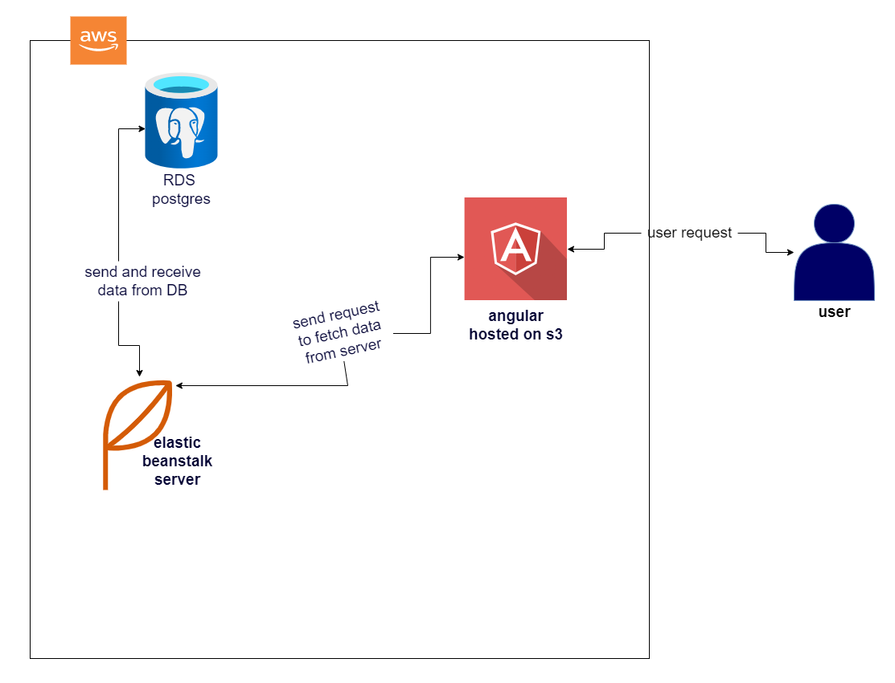

# Udagram Infrastructure
----------

 ### AWS LINKS
---------
   #### RDS PostgresQl
   the database used in this udagram is RDS database from AWS
   * database endpoint `database-2.cqkpcvq6ybip.us-east-1.rds.amazonaws.com`
   #### s3 bucket
   as the application front end is deployed on AWS s3 bucket you can access the application from bucket URL
   * application URL **s3 bucket** `http://udacity-udagram-app.s3-website-us-east-1.amazonaws.com`
   #### elastic beanstalk
* the back end is deployed on elasic beanstalk application from here you can access the api
elastic beanstalk URL `http://udacity-udagram.eba-znrwnpfi.us-east-1.elasticbeanstalk.com/`
----------